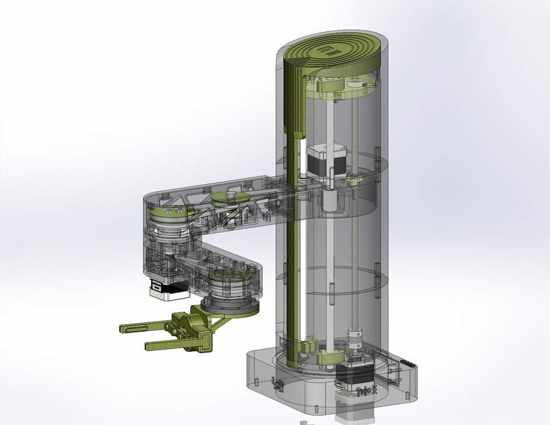
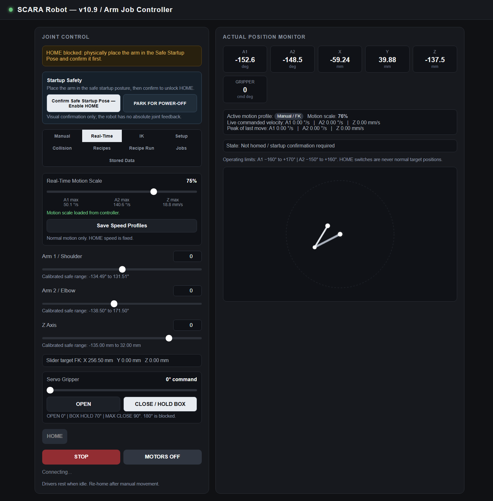

# SCARA Robot Arm

<p align="center">
  


A custom **4-axis SCARA robotic arm** developed as a mechatronics graduation project. The project covers the complete robot subsystem: mechanical design, 3D-printed structure, GT2 belt transmissions, ESP32 embedded control, stepper-motor actuation, homing and calibration, forward/inverse kinematics, collision-aware motion, recipe automation, a servo gripper, and a browser-based control interface.

## Project at a glance

| Item | Specification |
|---|---|
| Robot type | 4-axis SCARA robotic arm |
| Vertical Z stroke | 290 mm |
| Fixed base offset | L1 = 205 mm |
| Rotational links | L2 = 222 mm, L3 = 156.8 mm |
| Maximum documented reach | ~584 mm |
| Controller | ESP32 |
| Main actuators | 3 × NEMA 17 stepper motors |
| Stepper drivers | 3 × DRV8825 |
| End effector | MG90S servo gripper |
| Transmission | GT2 belts and pulley reductions |
| Vertical guidance | Lead screw + 10 mm shafts + LM10UU bearings |
| Position reference | Limit-switch homing |
| Current firmware | v10.22 |

## Full 3D design

The complete downloadable/printable 3D model package is available on Cults3D:

**[SCARA Robot Arm — full 3D design on Cults3D](https://cults3d.com/en/3d-model/gadget/scara-robot-arm-alsaadi)**

The manufacturing files are distributed there rather than duplicated in this repository. This GitHub repository is the engineering portfolio and software/documentation source for the robot.

## CAD and physical prototype

### Internal mechanical layout

<p align="center">
  
</p>

The transparent assembly exposes the internal motors, GT2 belt drives, pulley reductions, lead screw, guide shafts, bearings, and rotary-joint structure.

### Physical robot

<p align="center">
  
</p>

## Mechanical design

The arm was designed in SolidWorks and manufactured primarily with 3D-printed components. The mechanical architecture uses:

- a lead-screw Z axis for vertical motion;
- two 10 mm steel shafts with LM10UU bearings to resist cantilever bending;
- GT2 belt transmissions for the rotary joints;
- compound pulley reduction at the L1 → L2 transmission;
- a remotely positioned third stepper motor to reduce moving inertia at the end of the arm;
- thrust bearings for axial joint load and radial bearings for shaft alignment.

See **[the project report](docs/SCARA_Robot_Arm_Report.md)** for the mechanical design reasoning and calculations.

## Electronics

The control system uses an ESP32 as the main controller, three DRV8825 stepper drivers, three NEMA 17 motors, limit switches, and an MG90S servo gripper. A 12 V rail supplies the stepper system while a regulated low-voltage rail supplies the controller and servo.

See:

- **[Electronics documentation](docs/ELECTRONICS.md)**
- **[Bill of materials](docs/BOM.md)**
- **[Hardware configuration](docs/software/HARDWARE_CONFIGURATION.md)**

## Firmware — v10.22

The current firmware is in **[`firmware/v10.22/`](firmware/v10.22/)**. It was merged from the original standalone software repository so the complete SCARA project now lives in one canonical repository.

The sketch is split by subsystem instead of placing the entire robot into one large file:

```text
firmware/v10.22/
├── SCARA_ROBOT_ARM_CODE.ino        # hardware config, global state, setup/loop
├── 01_DriverControl.ino            # drivers and emergency stop
├── 02_CalibrationAndStorage.ino    # raw calibration and persistent settings
├── 03_JointCoordinates.ino         # coordinate/step conversions
├── 04_ForwardKinematics.ino        # FK
├── 05_InverseKinematics.ino        # IK
├── 06_MotionAndSafety.ino          # coordinated motion and safety
├── 07_HomingSequence.ino           # homing workflow
├── 08_WebApi.ino                   # browser/API control
├── 09_SerialDebug.ino              # diagnostics
├── 10_GripperControl.ino           # servo gripper
├── 11_CollisionSafety.ino          # collision envelopes / safe routing
├── 12_PackageRecipes.ino           # saved automation recipes
├── 13_ArmJobController.ino         # high-level job control
└── webpage.h                       # embedded browser interface
```

### Main software capabilities

- Joint-space manual motion
- Forward kinematics (FK)
- Inverse kinematics (IK)
- Raw-step calibration referenced from HOME switches
- Configurable motion profiles
- Controlled homing sequence
- Servo gripper control
- Collision-safety envelopes and safe routing
- Persistent settings and recipe storage
- Package recipe command timelines
- Higher-level arm job execution
- Browser-based operation and monitoring
- Serial diagnostics

> **Security:** personal Wi-Fi credentials from the development repository were removed during the merge. Configure your own network values before flashing the firmware.

## Web control interface

<p align="center">
  
</p>

The ESP32-hosted interface provides manual control, robot status, calibration tools, kinematic positioning, recipe functions, and system controls directly from a browser.

## Software documentation

For anyone studying, modifying, or rebuilding the control system:

- **[Calibration Guide](docs/software/CALIBRATION_GUIDE.md)**
- **[Kinematics](docs/software/KINEMATICS.md)**
- **[Software Architecture](docs/software/SOFTWARE_ARCHITECTURE.md)**
- **[Hardware Configuration](docs/software/HARDWARE_CONFIGURATION.md)**
- **[Troubleshooting](docs/software/TROUBLESHOOTING.md)**

## Repository structure

```text
scara-robot-arm/
├── README.md
├── firmware/
│   ├── README.md
│   └── v10.22/                  # complete ESP32 firmware
├── docs/
│   ├── SCARA_Robot_Arm_Report.md
│   ├── BOM.md
│   ├── ELECTRONICS.md
│   └── software/                # detailed control-system documentation
├── hardware/
│   ├── README.md
│   ├── cad/                     # CAD distribution notes
│   └── stl/                     # manufacturing-file distribution notes
├── media/
│   ├── cad/
│   ├── prototype/
│   └── web-interface/
├── LICENSE.md
└── .gitignore
```

## Building and commissioning

1. Download the mechanical files from the **[Cults3D project page](https://cults3d.com/en/3d-model/gadget/scara-robot-arm-alsaadi)**.
2. Build and wire the mechanical/electrical system.
3. Open `firmware/v10.22/SCARA_ROBOT_ARM_CODE.ino` in the Arduino IDE with the other firmware tabs in the same sketch folder.
4. Configure the required network values.
5. Verify driver current, motor direction, limit-switch behavior, and emergency-stop access.
6. Follow the **[Calibration Guide](docs/software/CALIBRATION_GUIDE.md)** before normal FK/IK operation.
7. Test each axis at low speed before running coordinated or automated movements.

## Safety

This is an experimental robotic system. Mechanical dimensions, step calibration, motor direction, joint limits, collision maps, gripper clearance, homing behavior, and driver current must be verified on the specific physical build before automated operation.

## Author

**Abdulrahman Alsaadi**  
Mechatronics / Robotics Engineering  
GitHub: [`ABDULRAHMAN-ALSAADI`](https://github.com/ABDULRAHMAN-ALSAADI)
